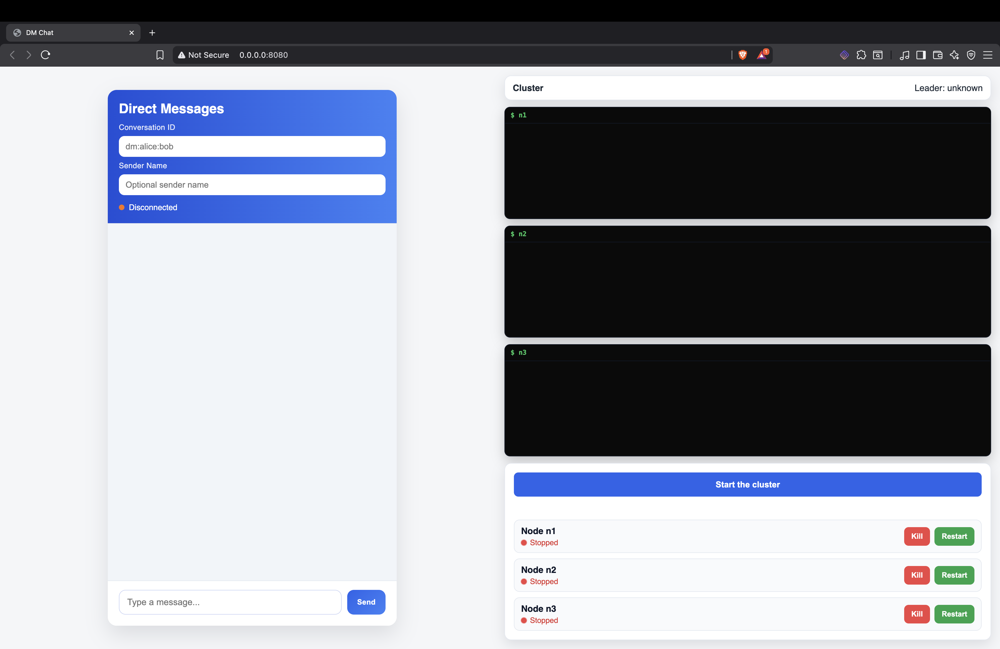
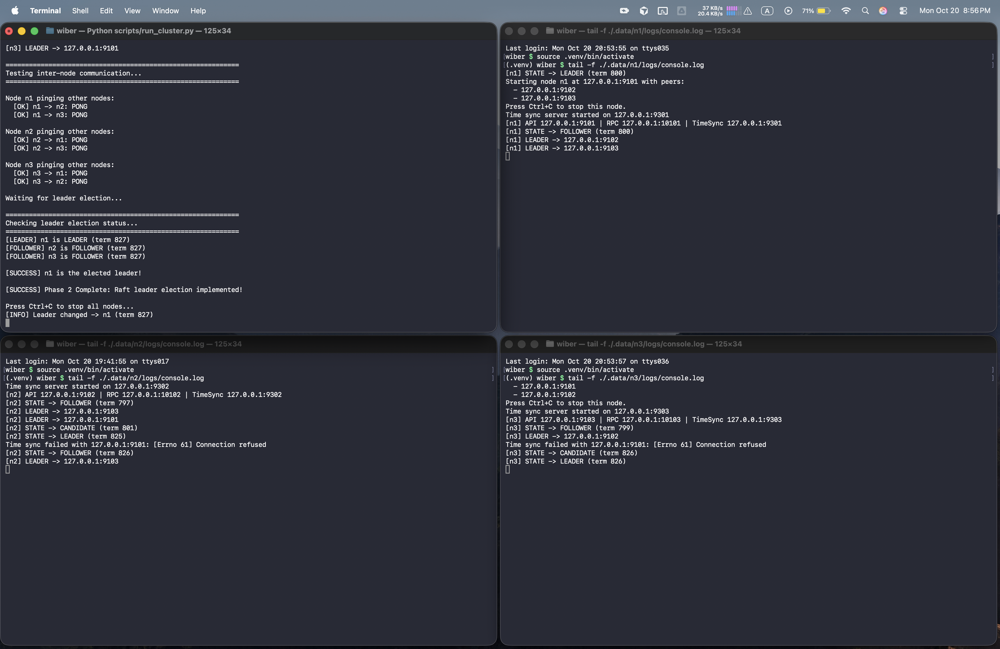

# Wiber - Distributed Messaging System

Wiber is a fully functional, multi-node, fault‑tolerant messaging system with a FastAPI gateway and a simple web UI. It runs locally without Kafka or Docker and includes cluster lifecycle controls (start/kill/restart), message history, and real‑time streaming over WebSockets.

## Goals (from Scenario 3)
- Fault tolerance: failure detection, replication, failover, recovery.
- Replication & consistency: leader-based or quorum, dedup, fast reads.
- Time sync: physical clock sync, Lamport clocks, bounded reordering.
- Consensus: leader election and log replication (e.g., Raft).
- Integration: coherent, testable system across modules.

## Features
- Multi-node cluster with start/kill/restart controls
- FastAPI gateway with REST + WebSocket endpoints
- Simple web UI to manage nodes and view logs live
- Message publish, subscribe, and history retrieval
- Runs locally; no Kafka or Docker required

## Quick Start

1. Create a virtual environment (optional but recommended)

   ```bash
   python3 -m venv .venv
   ```

2. Activate it

   ```bash
   source .venv/bin/activate
   ```

   Windows PowerShell:

   ```powershell
   .venv\Scripts\Activate.ps1
   ```

3. Install dependencies

   ```bash
   pip install -r docs/requirements.txt
   ```

4. Launch the FastAPI gateway + web UI

   ```bash
   python3 scripts/dm_gateway.py
   ```

5. Open the UI in your browser (default port 8080)

   ```text
   http://0.0.0.0:8080/
   ```

From the UI you can:
- Click **Start the cluster** to spawn all nodes defined in `config/cluster.yaml`.
- Use the per-node **Kill** / **Restart** buttons to manage individual nodes.
- Watch each node’s console output live in the three terminals.

Behind the scenes the gateway shells out to `scripts/run_node.py` for each node and tracks their subprocesses so the UI always knows which nodes are running.

## UI Screenshot

  

## Command-Line Recipes

### Run a Single Node (detached from the gateway)

```bash
# Replace n1 with the node id from config/cluster.yaml
python3 scripts/run_node.py --id n1

# Optional flags
#   --config path/to/cluster.yaml   (defaults to config/cluster.yaml)
#   --data-root /custom/data/dir    (defaults to ./.data)
```

Each node writes its console output to `.data/<node_id>/logs/console.log`, which is the
same file the gateway terminals stream in real time.

### Run the Cluster (all nodes)

Start the whole cluster with one command:

```bash
python3 scripts/run_cluster.py
```

Then, view each node's console output in separate terminals:

```bash
# Terminal A
tail -f ./.data/n1/logs/console.log

# Terminal B
tail -f ./.data/n2/logs/console.log

# Terminal C
tail -f ./.data/n3/logs/console.log

```
### Terminals in action

  

## Contribution Guide (suggested ownership)
- Member 1 - IT23632332 (Suhasna Ranatunga): Fault tolerance (node lifecycle, failover, recovery)
- Member 2 - IT23585284 (Praveen Hewage): Replication & consistency (`replication/`, dedup, commit flow)
- Member 3 - IT23631724 (Luchitha Jayawardena): Time sync (`time/`, reorder strategy)
- Member 4 - IT23651388 (Sanuk Ratnayake): Consensus (`cluster/raft.py`, elections, AppendEntries)
- Member 5 - IT23750760 (Dulain Gunawardhana): Integration and Testing

Coordinate interfaces via:
- Append entries API (leader → followers)
- Commit index propagation
- Client `PUB/SUB/HISTORY` semantics over committed entries

## Notes
- Docker and Kafka assets removed.
- Keep `scenario3.docx` for requirements and evaluation.
- The gateway listens on `0.0.0.0:8080` by default; override with `GATEWAY_PORT`.
